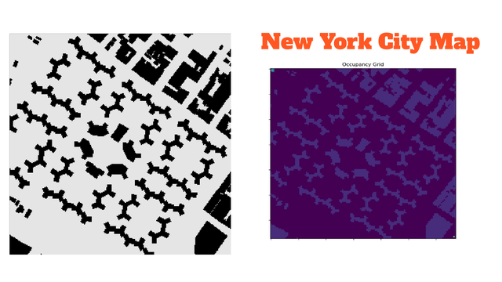
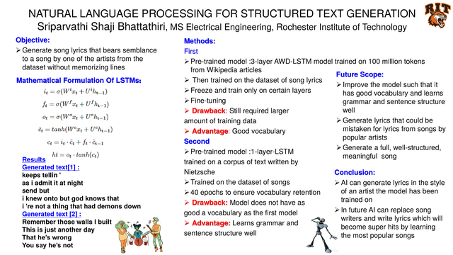
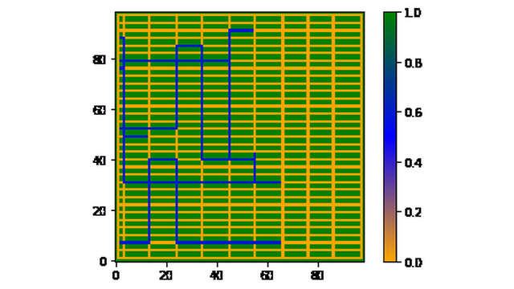

<picture>
  <source media="(prefers-color-scheme: dark)" srcset="assets/banner-dark.svg">
  <source media="(prefers-color-scheme: light)" srcset="assets/banner-light.svg">
  
</picture>

### Hi, I'm Sri 👋

**PhD candidate at Rochester Institute of Technology (RIT)**, working on AI and robotics for warehouse automation: multi-agent reinforcement learning for AMR fleets, simulation and digital twins, and human–robot interaction.

🎓 Graduating **December 2026**, open to **postdoctoral research positions** in robotics, RL, and HRI.

---

### 🔬 Research

- **Multi-agent RL for AMR dispatching.** Deep RL agents that decide which autonomous mobile robot takes which task in a simulated warehouse, trading off due dates and travel distance, benchmarked against rule-based dispatching heuristics.
- **Human–robot communication.** Gesture-based and intent-communication interfaces so people and robots can work safely side by side on the warehouse floor, including a gesture dataset and a recognition framework.
- **Warehouse simulation and digital twins.** Discrete-event simulation models for analyzing material-handling systems and path planning for autonomous vehicles.

I do this work as a Graduate Research Assistant in RIT's **Toyota Production System Lab** (Intelligent Material Handling Systems team), where I also mentor graduate and undergraduate students.

### 📚 Selected publications

- **Bhattathiri, S. S.**, Bogovik, A., Abdollahi, M., Hochgraf, C., Kuhl, M. E., Ganguly, A., et al. *Unlocking human-robot synergy: The power of intent communication in warehouse robotics.* **Applied Ergonomics**, 117, 104248 (2024).
- **Bhattathiri, S. S.**, Kuhl, M. E., Tondwalkar, A., Kwasinski, A. *Simulation analysis of a reinforcement-learning-based warehouse dispatching method considering due date and travel distance.* **Winter Simulation Conference** (2023).
- Kuhl, M. E., Bhisti, R., **Bhattathiri, S. S.**, Li, M. P. *Warehouse digital twin: Simulation modeling and analysis techniques.* **Winter Simulation Conference** (2022).
- **Bhattathiri, S. S.**, Li, M. P., Kuhl, M. E. *A traffic avoidance path planning method for autonomous vehicles in a warehouse environment.* **Winter Simulation Conference** (2021).
- Kazempour, B., **Bhattathiri, S. S.**, Rashedi, E., Kuhl, M. E., Hochgraf, C. *Framework for human-robot communication gesture design: A warehouse case study* (2025, preprint).

Full list on [Google Scholar](https://scholar.google.com/citations?user=SCAe6EMAAAAJ&hl=en).

### 🛠️ Tools

**Languages** 
    

**ML & vision** 
   

**Robotics & simulation** 
  

### 📌 Earlier projects

<table>
<tr>
<td width="50%" valign="top">

<h4><a href="https://github.com/ssb6096/Autonomous-mobile-manipulator">Autonomous Mobile Manipulator</a></h4>
AmigoBot with Xtion RGB-D camera, ORB-SLAM2 mapping in ROS, and an AL5B arm doing pick-and-place with inverse kinematics. 
<a href="https://www.youtube.com/watch?v=RUvS4jGKha0">▶️ Demo</a> · <a href="https://github.com/ssb6096/Autonomous-mobile-manipulator">📂 Code</a>
</td>
<td width="50%" valign="top">

<h4><a href="https://github.com/ssb6096/EMG_Controlled_Arm_Robot">Real-Time EMG-Controlled Arm Robot</a></h4>
Hand gestures from a Myo Armband, classified in real time (LDA / SVM / Random Forest), drive a robot arm. 
<a href="https://www.youtube.com/watch?v=Y88WK2LawpA">▶️ Demo</a> · <a href="https://github.com/ssb6096/EMG_Controlled_Arm_Robot">📂 Code</a>
</td>
</tr>
<tr>
<td width="50%" valign="top">

<h4><a href="https://github.com/ssb6096/Path_Planning_CNN">Mobile Robot Path Planning</a></h4>
CNN vs. Q-learning path planning on mazes and New York City maps converted to occupancy grids. 
<a href="https://github.com/ssb6096/Path_Planning_CNN/blob/master/docs/Path_Planning_CNN_RL_Presentation.pdf">📑 Slides</a> · <a href="https://github.com/ssb6096/Path_Planning_CNN">📂 Code</a>
</td>
<td width="50%" valign="top">

<h4><a href="https://github.com/ssb6096/Emotion_Detection_EEG_Signals">Emotion Detection from EEG</a></h4>
M.S. graduate paper: EEG pre-processing, spectral and statistical features, and SVM / KNN / RF / AdaBoost classifiers. 
<a href="https://www.youtube.com/watch?v=cSHnOIqt5nI">▶️ Video</a> · <a href="https://github.com/ssb6096/Emotion_Detection_EEG_Signals/blob/master/docs/Detection_of_Mental_State_Using_EEG_Signals.pdf">📄 Paper</a> · <a href="https://github.com/ssb6096/Emotion_Detection_EEG_Signals">📂 Code</a>
</td>
</tr>
<tr>
<td width="50%" valign="top">

<h4><a href="https://github.com/ssb6096/Volume_Estimation_2D_images">Food Volume Estimation from 2D Images</a></h4>
Camera calibration, ArUco frame transforms, Structure from Motion and NeRF to estimate food volume from photos. 
<a href="https://www.youtube.com/watch?v=0JI2T99j86U">▶️ Demo</a> · <a href="https://github.com/ssb6096/Volume_Estimation_2D_images/blob/master/docs/Food_Volume_Estimation_Poster.pdf">📑 Poster</a> · <a href="https://github.com/ssb6096/Volume_Estimation_2D_images">📂 Code</a>
</td>
<td width="50%" valign="top">

<h4><a href="https://github.com/ssb6096/Natural_Language_processing-Structured_Text_Generation">Lyrics Generation with LSTMs</a></h4>
Transfer learning with AWD-LSTM and LSTM language models to write song lyrics in an artist's style. 
<a href="https://github.com/ssb6096/Natural_Language_processing-Structured_Text_Generation/blob/master/docs/NLP_Structured_Text_Generation_Poster.pdf">📑 Poster</a> · <a href="https://github.com/ssb6096/Natural_Language_processing-Structured_Text_Generation">📂 Code</a>
</td>
</tr>
<tr>
<td width="50%" valign="top">

<h4><a href="https://github.com/ssb6096/Traffic-Avoidance-Path-Planning">Traffic Avoidance Path Planning (WSC 2021)</a></h4>
Neural-network traffic prediction + A* for warehouse AMRs; cut average travel time by ~21% vs. plain A*. 
<a href="https://doi.org/10.1109/WSC52266.2021.9715318">📄 Paper</a> · <a href="https://github.com/ssb6096/Traffic-Avoidance-Path-Planning">📂 Code</a>
</td>
<td width="50%" valign="top">

<h4><a href="https://github.com/ssb6096/Simio-BBQ-Restaurant-Simulation">Simio BBQ Restaurant Simulation 🏅</a></h4>
Simio Student Competition 2020, semi-finalist (with Catherine Wright). OptQuest + KN selection halved walk-away customers. 
<a href="https://www.youtube.com/watch?v=aznitAY63tw">▶️ Video</a> · <a href="https://github.com/ssb6096/Simio-BBQ-Restaurant-Simulation">📂 Model</a>
</td>
</tr>
</table>

More on my [Portfolium portfolio](https://portfolium.com/ssb6096/portfolio).

---

📫 Reach me at ssb6096@g.rit.edu or on [LinkedIn](https://linkedin.com/in/sriparvathi-bhattathiri).
